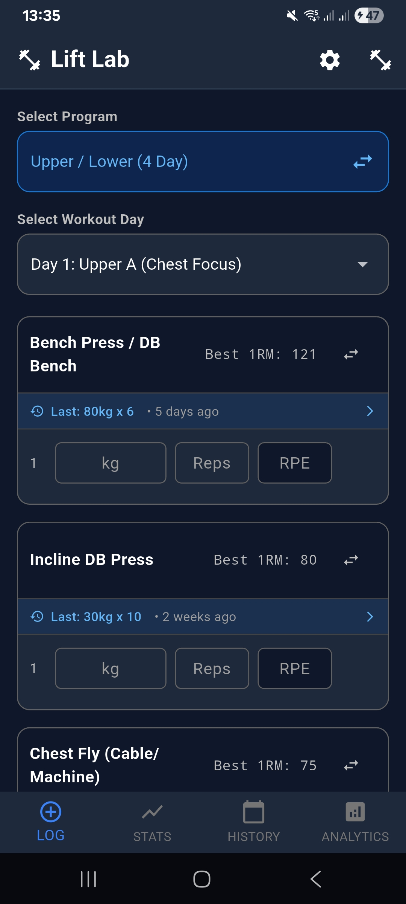
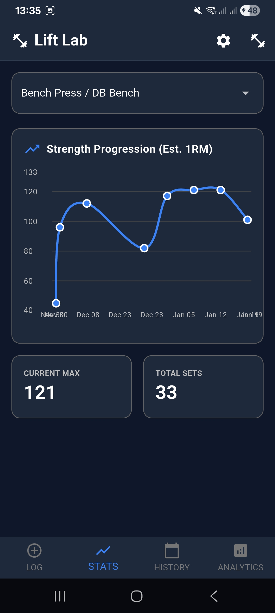
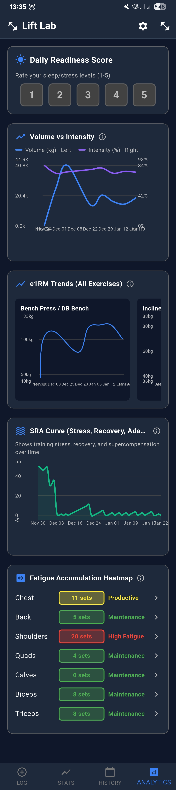
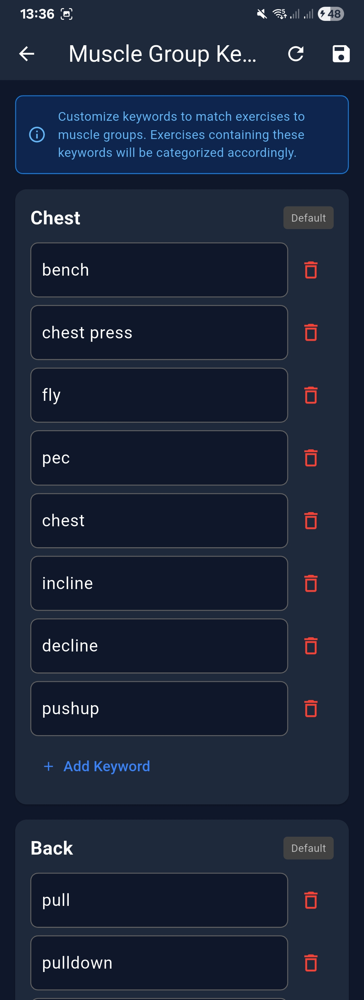
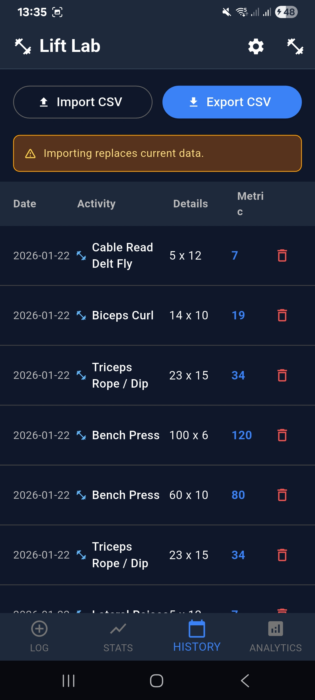

# LiftLab

**LiftLab** is an open source fitness analytics tracking platform designed to empower users with comprehensive insights into their strength training and fitness journey.

## What is LiftLab?

LiftLab is a cross-platform mobile and web application built with Flutter that provides athletes, fitness enthusiasts, and strength trainers with powerful tools to track, analyze, and optimize their workouts. Unlike proprietary fitness apps, LiftLab is committed to transparency, user privacy, and community-driven development.

## What We Aim to Achieve

Our mission is to create a **free, open source fitness analytics platform** that:

- **Tracks Workouts Comprehensively**: Record exercises, sets, reps, weights, and rest periods with an intuitive interface
- **Provides Advanced Analytics**: Visualize progress over time with charts, graphs, and statistical insights
- **Enables Data Ownership**: Your fitness data belongs to you - export, backup, and control your information
- **Fosters Community**: Built by the community, for the community, with open development and contributions
- **Respects Privacy**: No tracking, no ads, no data selling - just pure fitness tracking
- **Cross-Platform Accessibility**: Available on iOS, Android, Web, Windows, macOS, and Linux

## Vision: Open Source Fitness Analytics

LiftLab aims to be the go-to open source solution for fitness tracking, where:

- **Developers** can contribute features, fix bugs, and shape the platform's direction
- **Users** have full transparency into how their data is handled and stored
- **The Community** drives innovation through open collaboration and feedback
- **Fitness Professionals** can customize and extend the platform for their specific needs

We believe fitness tracking should be accessible, transparent, and user-controlled. By being open source, LiftLab ensures that the platform evolves based on user needs rather than corporate interests.

## Screenshots

  <table>
    <tr>
      <td align="center">
        <strong>Home Screen</strong> 
        
      </td>
      <td align="center">
        <strong>Progress Tracking</strong> 
        
      </td>
      <td align="center" rowspan="2">
        <strong>Analytics Dashboard</strong> 
        
      </td>
    </tr>
    <tr>
      <td align="center">
        <strong>Muscle Groups</strong> 
        
      </td>
      <td align="center">
        <strong>Data Export</strong> 
        
      </td>
    </tr>
  </table>

## Getting Started

This project is built with Flutter. To get started:

1. Ensure you have Flutter installed ([Install Flutter](https://flutter.dev/docs/get-started/install))
2. Clone this repository
3. Run `flutter pub get` to install dependencies
4. Run `flutter run` to launch the app

## Contributing

We welcome contributions! Whether you're fixing bugs, adding features, improving documentation, or providing feedback, your help makes LiftLab better for everyone.

## License

MIT

---

**Built with ❤️ by the fitness community, for the fitness community.**
